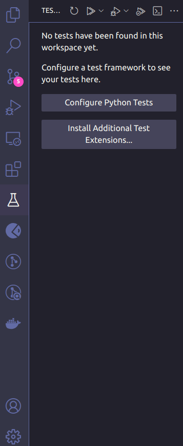
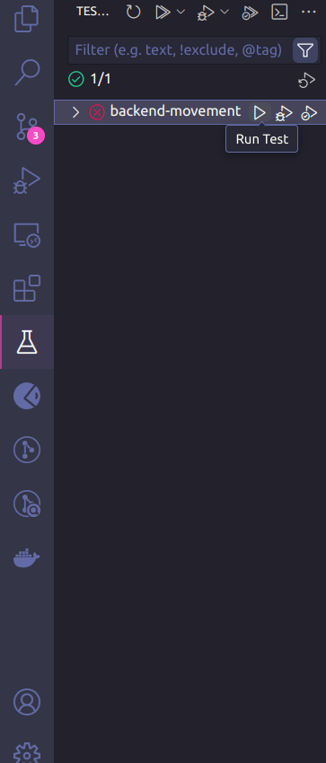

# Testes

Este projeto utiliza **pytest** para a execução dos testes automatizados. Este README fornece instruções sobre como configurar e executar os testes de forma eficaz. Os testes são executados localmente. Todas as instruções consideram que você está na pasta raíz do projeto.

## Pré-requisitos

Antes de rodar os testes, certifique-se de que você tem o seguinte instalado:

- Python 3.9

## Configuração do Ambiente Virtual

Recomendamos criar um ambiente virtual para isolar as dependências do projeto. Caso não tenha o ambiente virtual configurado, siga as instruções abaixo:

### Criar o ambiente virtual

```bash
python3 -m venv venv
```

### Acessar o ambiente virtual

```bash
source venv/bin/activate
```

## Instalação das dependências necessárias para rodar o projeto localmente

```bash
cd app/
```

```bash
pip install -r requirements.txt
```

## Execução dos testes no terminal

```bash
cd app/
```

```bash
pytest --cov=.
```

## Execução dos testes pelo visual studio code

1. Clicar no ícone da extensão de teste no menu esquerdo, e clicar no botão "Configure Python Tests"
<div>

</div>
<br>

2. Selecionar "pytest"
<div>

</div>
<br>

3. Para rodar os testes, é possível:

    * Clicar no botão "Run test" para rodar os testes sem a exibição do percentual de cobertura do testes
    <div>
    
    </div>
    
    * Clicar no botão "Run Test with Coverage" para rodar os testes com a exibição do percentual de cobertura do testes
    <div>
    
    </div>